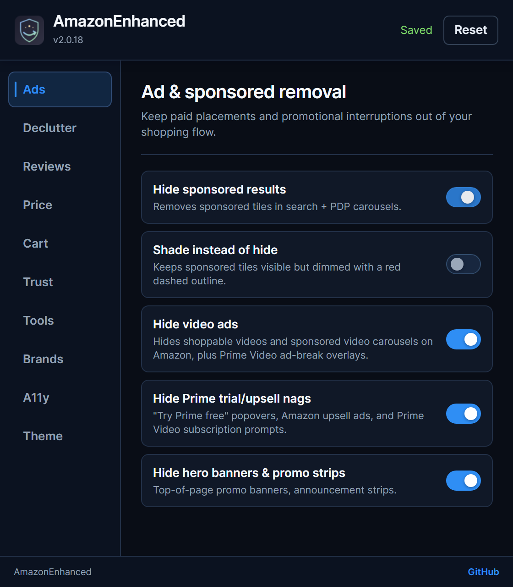
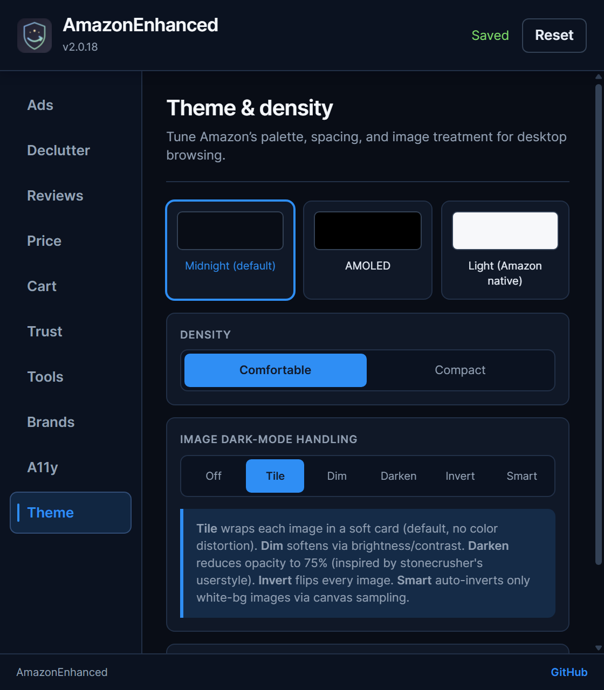

# AmazonEnhanced v2.0.18

[](https://github.com/SysAdminDoc/AmazonEnhanced/releases/tag/v2.0.18) [](LICENSE) [](#install)

<p align="center">
  <a href="https://ko-fi.com/X8K126YVER">
    
  </a>
</p>

<p align="center">
  <sub><em>If this project helps you, a coffee helps me keep working on it.</em></sub>
</p>


## Less clutter. More room to compare.

AmazonEnhanced is a free desktop browser extension for people who want Amazon's product pages without so much promotion. Hide sponsored placements, choose a dark theme and keep a local record of prices you've seen. Change individual settings whenever you want.

[Download for Chrome or Edge](https://github.com/SysAdminDoc/AmazonEnhanced/releases/download/v2.0.18/AmazonEnhanced-v2.0.18-release.zip) · [User guide](docs/guide.md) · [Release notes](docs/release-notes.md)



*Captured from the installed extension in a fresh, isolated browser profile. No shopping account is shown.*

## What it adds

- **Make browsing quieter.** Hide sponsored results and selected recommendation sections. Shade paid placements instead if you'd rather keep them visible.
- The default Midnight theme gives Amazon a dark palette. AMOLED, light mode and image treatments are available in Theme.
- **Compare the prices you've actually seen.** Local history, unit-price estimates and variant comparisons add context to a listing. No price-history account is required.
- Export visible orders or wishlists when you need your own copy. Review summaries and seller labels provide extra context, with the limitations below.

The [guide](docs/guide.md) covers all ten settings sections, data exports and the 20 declared Amazon marketplaces. Walmart, Target, Best Buy and Etsy have separate visible-review helpers, not the full Amazon feature set.

## Install

### Chrome or Microsoft Edge

1. [Download the release ZIP](https://github.com/SysAdminDoc/AmazonEnhanced/releases/download/v2.0.18/AmazonEnhanced-v2.0.18-release.zip) and extract it to a permanent folder. Keep that folder after installation.
2. Open `chrome://extensions` or `edge://extensions` and enable Developer mode.
3. Choose **Load unpacked**, then select the extracted folder containing `manifest.json`.
4. Pin AmazonEnhanced from the browser's Extensions menu. Open its settings, then refresh any Amazon tabs that were already open.

This is a manual installation, not a Chrome Web Store or Edge Add-ons listing. For updates, replace the contents of the same folder, click Reload on the extension card and refresh Amazon tabs. Export local history first if you want a backup. See [Chrome's unpacked-extension instructions](https://developer.chrome.com/docs/extensions/get-started/tutorial/hello-world#load-unpacked).

The signed CRX is a secondary download for compatible self-host or managed installation tools. It isn't the recommended drag-and-drop installation route. The Edge-specific ZIP is also available on the [release page](https://github.com/SysAdminDoc/AmazonEnhanced/releases/tag/v2.0.18).

### Firefox development build

The release includes an **unsigned XPI for temporary testing**, not a permanent end-user Firefox install. Use `about:debugging`, choose **This Firefox**, then **Load Temporary Add-on** and select the XPI. It is removed when Firefox restarts. Normal Firefox distribution requires Mozilla signing. [Temporary installation](https://extensionworkshop.com/documentation/develop/temporary-installation-in-firefox/) · [Signing requirements](https://extensionworkshop.com/documentation/publish/signing-and-distribution-overview/)

## Start with your settings

Ads controls paid placements. Declutter controls recommendation sections. Theme changes the palette and image treatment. Changes are saved locally and sent to open Amazon tabs.

**Check Cart before shopping.** Several checkout helpers are on by default. They can select one-time purchase, decline warranty or upgrade offers and clear preselected trials or extras. Turn off anything you don't want automated. Always review the final order yourself.



## Know the limits

Amazon changes its pages frequently. A setting can miss a placement or affect a section you wanted to keep. Disable that setting, refresh the page and [report the problem](https://github.com/SysAdminDoc/AmazonEnhanced/issues) with the browser version and a redacted screenshot.

- Price history grows from observations in this browser. Currency isn't stored, so keep comparisons to one marketplace. Alerts aren't a live price feed, and unit prices depend on correct listing text.
- Review scores, seller-name comparisons and large price-spread warnings are heuristics. They don't prove fraud, counterfeit goods or product quality.
- An ingredient watchlist can miss information that isn't on the page. Check the actual product label; don't use it as an allergy safety check.
- Ad decluttering doesn't promise uninterrupted Prime Video playback or complete ad removal. Exports cover loaded or visited records, not a complete account archive.

The [verification notes](docs/release-notes.md) distinguish isolated fixture checks from live-site acceptance. Screenshots show the actual extension, not proposed interface designs.

## Your data stays under your control

Settings and shopping observations are stored in your browser profile. There is no extension account or analytics service. Tools includes history import, diagnostic export and local-data controls. Exported orders, invoices and wishlists can contain personal information, so review files before sharing them.

Optional OpenCorporates lookup is off by default. Enabling it requests access and sends seller names to OpenCorporates using your API token. Invoice export fetches same-origin invoice links through your existing Amazon session. Wishlist import performs the Add to List actions you start. [Data and permissions](docs/guide.md#data-and-permissions)

## Build or contribute

Readable JavaScript, CSS and HTML. No remote executable code or runtime package installation.

```sh
npm ci
npm test
npm run build:release
```

Load `dist/` as an unpacked extension. [Development and package checks](docs/development.md) explain the isolated browser tests and CRX, Edge and Firefox builds. Original artwork, source snapshots and visual reviews are kept in the [concept archive](assets/concepts/2026-09-09-marketing/README.md).

MIT licensed. See [LICENSE](LICENSE) and [third-party notices](THIRD_PARTY_NOTICES.txt).

AmazonEnhanced is an independent project. It isn't affiliated with or endorsed by Amazon or the other supported retailers.
