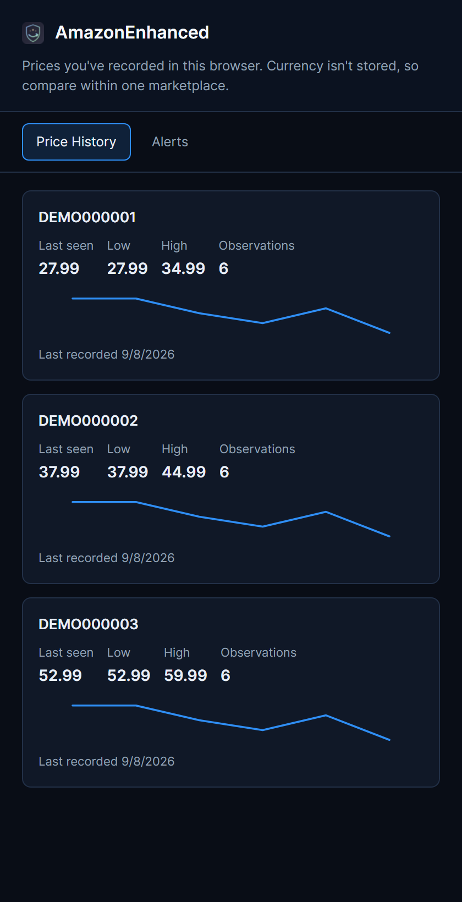

# AmazonEnhanced v2.0.18 user guide

Start with the [installation instructions](../README.md#install). Open the extension from the browser toolbar to change its settings.

## Find the right setting

| Section | What you'll find |
| --- | --- |
| Ads | Hide or shade sponsored placements; hide selected video promotions and trial prompts |
| Declutter | Individual controls for recommendation rails, homepage sections and the shopping-assistant panel |
| Reviews | Local scoring and up to 20 visible review excerpts per product |
| Price | Unit-price estimates, list-price comparisons, clean links and observed-price alerts |
| Cart | Automatic trial, warranty, upgrade and preselected-extra controls; shipping-change warnings |
| Trust | Seller and origin labels, name mismatch warnings, local price history and variant comparisons |
| Tools | Order and wishlist exports, wishlist import, history import and diagnostics |
| Brands | Optional Amazon-brand, all-caps pattern and custom regular-expression filters |
| A11y | Larger text, high contrast, button labels and a text-based ingredient watchlist |
| Theme | Midnight, AMOLED or light; comfortable or compact spacing; six image treatments |

## Choose what changes automatically

Sponsored hiding, several declutter settings and most Cart helpers are enabled on a fresh install. Cart helpers can click an explicit decline action, select one-time purchase or clear preselected extras. Review the Cart and Declutter sections before using your normal shopping session. Settings don't replace a final check of the order, price and delivery address.

Seller lookup, price alerts, late-delivery notifications, custom brand rules, ingredient matching and CPU Tamer start off. CPU Tamer is experimental; it changes background timers and may affect site behavior.

Hide sponsored and Shade instead of hide are mutually exclusive. If something important disappears, turn off its setting and refresh the page. A page redesign may require an extension update.

## Theme and images

Midnight is the default. AMOLED uses a darker palette; light mode keeps the site's native presentation. Tile gives product images a light mat without inverting their colors. Dim and Darken reduce brightness. Invert can distort photos. Smart samples image corners and may fall back when the image server prevents pixel access.

## Local prices, reviews and alerts

Open product pages to build a history. This extension records observed prices by product ID in the current browser profile, not a continuously refreshed price feed. The price-history panel and product-page charts use that local data. Changing browser profiles starts a separate history unless you import an export.

Price alerts compare targets with locally recorded prices. A closed or unvisited product isn't continuously polled for a fresh price. Imported data is still historical data, not a quote you can buy at.

History records don't store currency. Use one marketplace for meaningful comparisons. The side panel shows raw recorded values, not converted US-dollar prices.

*Actual installed panel with invented price histories imported into a fresh profile. These aren't live products or quotes.*

Review analysis uses visible ratings, review counts and the available sample. It can over- or under-estimate useful signals. A brand and seller name mismatch also has innocent explanations. These indicators are prompts to check a listing, not evidence of deception.

## Export or move your data

- Product pages can copy a clean Markdown product link and export the current product's price history. Tools can import a compatible price-history JSON file.
- On an orders page, exports use the records currently available to the page. Invoice export fetches one same-origin candidate at a time, accepts PDF responses and reports missing invoices. It won't reconstruct your entire order history.
- Wishlist export supports CSV, JSON and Markdown. Import accepts an AmazonEnhanced JSON export and runs the Add to List actions you explicitly start. Keep the source wishlist tab open while it runs.
- Tools can export a local diagnostic report or clear stored feature data. Settings and the optional lookup credential are separate. Remove the credential through its own control or remove the extension if you need to erase the whole profile-owned installation.

Exports can include order details, receipts or review text. Don't attach them to a public issue without checking their contents.

## Data and permissions

Local storage includes settings, price points, review excerpts, product snapshots, purchase summaries, seller/origin caches, watched-order dates and a bounded error buffer. Structural health diagnostics keep hook identifiers and counts, not page text or account contents. No analytics endpoint receives this data automatically.

| Access | Purpose |
| --- | --- |
| Storage | Settings and local feature data; larger records use IndexedDB |
| Alarms and notifications | Local maintenance and enabled alerts |
| Declarative network requests | Bounded ad-request blocking and tracking-parameter cleanup |
| Side panel | Local history in Chromium; Firefox uses its sidebar |
| Scripting | Inject enabled feature modules into supported pages |
| Amazon and Prime Video sites | The shopping and declutter features |
| Walmart, Target, Best Buy and Etsy | Local analysis of visible reviews on supported product routes |
| Optional OpenCorporates API | Seller lookup after explicit enablement and host-access approval |

OpenCorporates is the optional external lookup. Seller names and the supplied API token are sent to that service. The token is held separately in extension-owned IndexedDB and isn't included in page-visible settings. Browser/site requests needed for shopping still happen normally; the extension isn't a network anonymity tool.

## Declared marketplaces

Amazon `.com`, `.co.uk`, `.ca`, `.de`, `.fr`, `.it`, `.es`, `.nl`, `.pl`, `.se`, `.com.tr`, `.in`, `.co.jp`, `.com.au`, `.com.mx`, `.com.br`, `.sg`, `.sa`, `.ae` and `.eg` are declared in the manifest. Structural fixtures cover localized sponsorship labels. This doesn't establish that every feature works on every current regional page.

The four other retailers have visible-review helpers only. Prime Video support hides selected promotional elements; it doesn't guarantee ad-free video.
